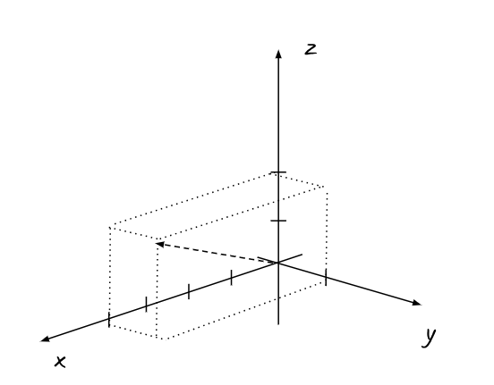
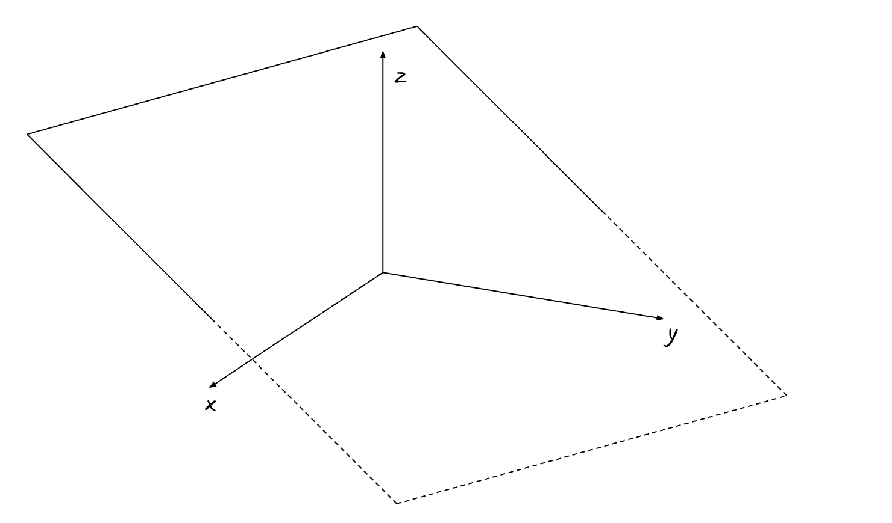
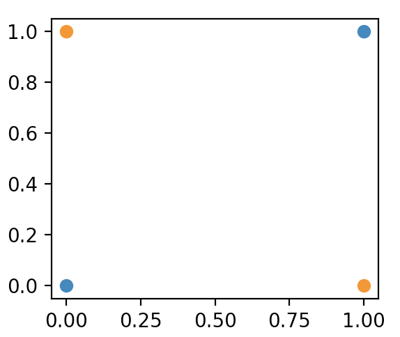
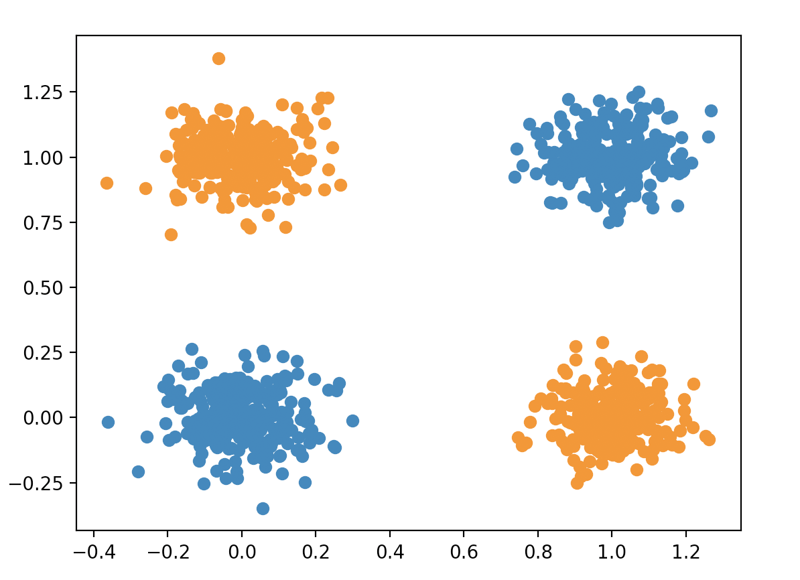
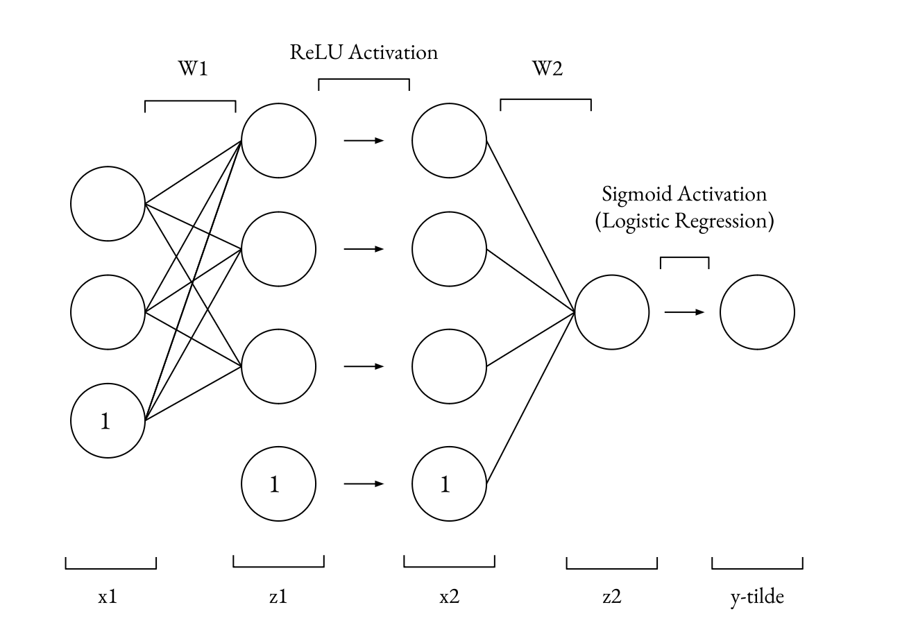
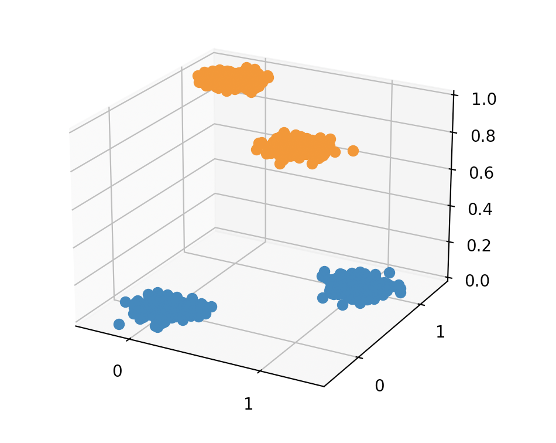
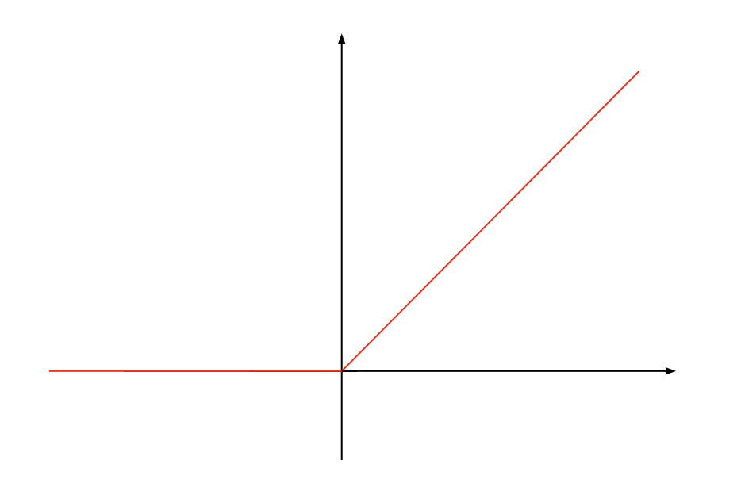
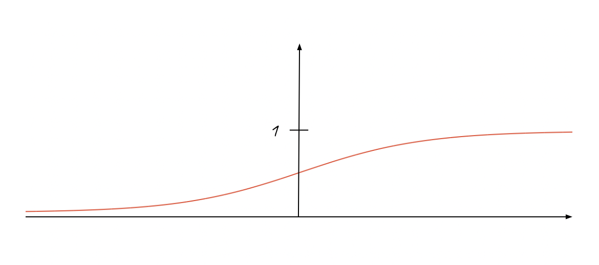

+++
title = "A Mathematical Dive Into a Toy Neural Net"
date = 2023-08-26
draft = false

[taxonomies]
categories = ["Things I Also Find Cool"]
tags = []

[extra]
lang = "en"
toc = true
comment = true
copy = true
math = "katex"
mermaid = true
outdate_alert = false
outdate_alert_days = 120
display_tags = true
truncate_summary = false
featured = false
reaction = false
+++
_This post was adapted from a document I wrote in August 2023 for new members of my engineering project team,
[CUAir](https://cuair.org/). My subteam, in particular, writes ML models for computer vision tasks. I thought this
would be a cool intro to our work._

## Introduction

I think it would be difficult for me to overstate the prevalence of neural networks. Truthfully, they have been an enigma to me for more time than I care to admit, particularly as a member of [IntSys](https://cuair.org/intelligent-systems.html). That said, this little secret made my journey of discovery all the more gratifying, which is why I wanted to share it. 

Through a toy example, I hope to show you all the ingenious foundations of the neural network. Even through this small example, all the key components are there; even the littlest of these things provide a spectrum of delightful discoveries. Each piece plays a key role, and all of its components are grounded in rigorous math, so I promise I won't throw a bunch of fluff at you. At the same time, it's my goal to make every decision and design choice as intuitive as possible; from there, I hope you'll find the journey as insightful as I did.

Onwards!

## Mathematics You Might Find Useful

If this is your first introduction to these topics, welcome! If you're just re-familiarizing yourself with them, that's great too. Come back to these sections as you see fit.

### Vectors

For our purposes, it will be helpful to think of vectors in two ways, interchanging between the two as the need arises: the literal and the geometric perspectives.

Literally, a vector is a list of numbers, ordered top-to-bottom in a column. Geometrically, the number in each row inhabits a "dimension" along an axis. You can think about each row of a vector capturing how "much" of each dimension the vector would like, axis-by-axis, before placing its dot down in space.

Here's an example of a vector $ \vec{v} = \begin{bmatrix} 4  \newline 1  \newline 2 \end{bmatrix} $ in space.

If a vector has $n$ dimensions, we say the vector $\vec{x}$ exists in $\mathbb{R}^n$, or: $\vec{x} \in \mathbb{R}^n$.

### Functions

In the most abstract sense, a function is a way to connect the elements from one set to the elements from another set. Each set could contain pretty much anything; the function's job is solely to define a bunch of rules that take elements from the first set, and attach them to elements from the second set.

#### 1-D Functions
We're used to these. These are functions like $f(x) = x^2$, or $f(x) = e^x$. In both of these cases, the sets being mapped from and to are both the real numbers $\mathbb{R}$. There is exactly one input and exactly one output. We denote these types of functions as $f: \mathbb{R} \to \mathbb{R}$.

#### Multi-Dimensional Functions
These functions are a little more needy, in that they take in multiple inputs and often produce multiple outputs. They're not much different than normal 1-D functions; they just define a few more rules that include a few more variables. For example:

$$ x_3 = f(x_1,x_2) = x_1^2 + x_2^2 $$

defines a paraboloid in $\mathbb{R}^3$ (a 3-D parabola). This is a function that fits the description "$f: \mathbb{R}^2 \to \mathbb{R}$" because it takes two numbers (or, equivalently, a 2-D vector) and outputs a scalar, real value.

Next, we can define any function that takes an $n$-D vector as an input and outputs an $m$-D vector: $f: \mathbb{R}^n \to \mathbb{R}^m$. In fact, because the output is an $m$-D vector, we can break down the function row-by-row into $m$ separate functions, as shown:

$$\vec{y} = f\left(\vec{x}\right) = \begin{bmatrix} f_{1}\left(\vec{x}\right) \newline f_{2}\left(\vec{x}\right) \newline  \vdots \newline  f_{m}\left(\vec{x}\right)\end{bmatrix}$$

Here's a small, 2-D to 2-D example.

$$ \begin{equation}
  f\left(\vec{x}\right) = \begin{bmatrix} \cos(x_1) + \sin (x_2) \newline \sqrt{x_1^2 + x_2^2}\end{bmatrix}
\end{equation} $$

We'll soon see that this notation is very powerful in constructing something called the Jacobian matrix (briefly, it's a multi-dimensional derivative). More on that later.

#### Injectivity and Surjectivity

This section highlights classifications that could describe any type of function, regardless of the sets on which they define rules.

Generally, a function is injective if it "preserves the distinctness" of the input values when matching them to output values. This means that no two input values can be tied to the same output. Another word for an injective function is "one-to-one", which properly captures this idea of preserving distinctness. Importantly, preserving distinctness means that, given a certain output of the function, it is possible to backtrack and find the _single_ original input that produced that output (i.e. in some sense, an inverse of the function exists).

This is not necessarily the case with surjective functions, which instead assert that every possible output of the function must have at least one input tied to it. So, this property is unbothered by the fact that many inputs could be tied to the same output. Importantly, this means that it is \textbf{not} always possible to trace back to exactly one original input for a given function output. Surjective functions can "squashify" the first set onto a smaller or equally-sized second set. This is why surjective functions are also called "onto" functions.

#### Linear Operators
"Operator" is another word for "function", and I think it makes for a cool-sounding sub-title. Here is the formal definition of what it means for an operator to be linear: given some operator $T$, input variables $x_1, x_2$, and any scalar quantity $a$, the function $T$ is a linear operator if and only if

$$T(x_1 + x_2) = T(x_1) + T(x_2)$$
$$T(a\cdot x_1) = a\cdot T(x_1)$$

are both true. To many of you, this definition might seem like a mild betrayal; the two conditions above mean the classic function of the 1-D line, $f(x) = mx + b$, is \textbf{not} a linear function for $b \neq 0$. We can see that neither condition holds, unless $b = 0$. It is an example of an "affine" function, which is a linear function that has been offset by the addition of some number.

#### Matrices
Matrices are gentle giants. As with vectors, they have several characterizations that will each be valuable in different contexts. Literally, matrices are an array of numbers, ordered by rows and columns. For example, here is a $3\times 4$ matrix $A$. We say $A \in \mathbb{R}^{3 \times 4}$ because it has 3 rows and 4 columns, populated with real-numbered values:

$$A = \begin{bmatrix}
    1 & 2 & 3 & 4 \newline
    5 & 6 & 7 & 8 \newline
    9 & 10 & 11 & 12
\end{bmatrix}$$

We index the elements of the matrix as follows: $A_{ij}$ refers to the element in the $i$th row and the $j$th column of A. So $A_{2, 3} = 7$.

Here is the more insightful perspective to hold on matrices: they are a type of linear operator. They take in vectors, and output other vectors. Let's take our matrix $A$ from earlier, and create a function out of it. It takes in a vector $\vec{x}$ and outputs a vector $\vec{y}$:
$$\vec{y} = f(\vec{x}) = A\vec{x}$$
Here's how you multiply vectors and matrices: **1)** Always keep the vector to the right of the matrix. **2)** Pick your vector up vertically, flip it counterclockwise $90^{\circ}$ till it's horizontal. **3)** For each row of the matrix, multiply each dimension of the vector with the corresponding entry of the row of the matrix. **4)** Add up these element-wise products for each row. **5)** Repeat for all the rows. Here's an example:

$$ \begin{equation*}\vec{y} = f\left(\begin{bmatrix} x_1 \newline x_2 \newline x_3 \newline x_4\end{bmatrix}\right) = \begin{bmatrix}
    1 & 2 & 3 & 4 \newline
    5 & 6 & 7 & 8 \newline
    9 & 10 & 11 & 12 \end{bmatrix}\begin{bmatrix} x_1 \\ x_2 \\ x_3 \\ x_4\end{bmatrix} = \begin{bmatrix}
    x_1 + 2x_2 + 3x_3 + 4x_4 \newline
    5x_1 + 6x_2 + 7x_3 + 8x_4 \newline
    9x_1 + 10x_2 + 11x_3 + 12x_4 \end{bmatrix}\end{equation*} $$

Notice that $f: \mathbb{R}^4 \to \mathbb{R}^3$ takes in a four-dimensional vector, and outputs a three-dimensional vector. Notice also that this means that $f$ **cannot** be an injective function; the matrix compresses four dimensions into three dimensions, so it is impossible to preserve the distinctness of all input vectors. 

Follow-up: does any linear function from higher to lower dimensions need to be surjective? Take a moment to ponder...

**Note:** if you want to multiply two matrices, it's not too different from steps **1-5** listed above. The product of two matrices is another matrix. You treat every column of the matrix on the right as a vector, and go through all five steps for each column, placing these new columns left-to-right in a new matrix. 

#### More On Matrices as Linear Operators

Associated with interpreting them as linear functions, here's another useful perspective on matrices: a preserver or destroyer of information.

First, what do I mean by "information"? I mean the dimension (or "size") of the spaces on which input vectors and output vectors of matrices lie. For example, the space of input vectors for matrix $A$ from the section above was all of $\mathbb{R}^4$, so its input space was of "size" 4.

You might be thinking that, because the matrix $A$ outputs vectors in $\mathbb{R}^3$, the output space of $A$ is three-dimensional. This actually isn't the case.

In fact, the outputs of $A$ lie on a two-dimensional "sub-space" of $\mathbb{R}^3$, often known as a "plane". In the same way that every point on a 1-D line in $\mathbb{R}^2$ is defined by a 2-D vector, this sub-space plane is two dimensional while being composed of three-dimensional vectors.

We can safely ignore the details of the specific output plane. The important part is that matrices can destroy and preserve as much information as we allow them to. In this case, $A$ projects four dimensions onto two dimensions; it collapses two dimensions' worth of information.

Importantly, it is impossible for matrices to "create" information. For example, they cannot take an input space of one dimension and transform it into an output space of two dimensions. Matrices are not in the business of telling lines how to add enough information to become planes; they merely instruct the line to lose information or transform itself to another line. This idea is central to why neural networks are necessary in the first place.

By reading this, you've hit on core linear algebra topics, like "rank" and "sub-space transformations". The notion of information preservation is both interesting and an enlightening perspective to hold while learning linear algebra; if you found these topics interesting, I encourage you to reach out or look for more resources online.

### Gradients

Although typically challenging to visualize, gradients are nothing more than derivatives on functions of any dimension. Let's take the following function:

$$G\left(\vec{x}\right) = \begin{bmatrix} G_{1}\left(\vec{x}\right) \newline G_{2}\left(\vec{x}\right) \newline \vdots \newline G_{m}\left(\vec{x}\right)\end{bmatrix}$$

The gradient (Jacobian) of $G$ with respect to $\vec{x}$ is:

$$\frac{dG}{d\vec{x}} = \begin{bmatrix}
\frac{\partial G_1}{\partial x_1} & ... & \frac{\partial G_1}{\partial x_n} \newline
\vdots & \ddots & \vdots \newline
\frac{\partial G_m}{\partial x_1} & ... & \frac{\partial G_m}{\partial x_n}
\end{bmatrix}
$$

#### Example
Let's do a quick computation using this definition. From 2.2.2, take our example function $f: \mathbb{R}^2 \to \mathbb{R}^2$:
$$ f\left(\vec{x}\right) = \begin{bmatrix} \cos(x_1) + \sin (x_2) \newline \sqrt{x_1^2 + x_2^2}\end{bmatrix} $$

So, $f_1\left(\vec{x}\right) = \cos(x_1) + \sin (x_2)$ and $f_2\left(\vec{x}\right) = \sqrt{x_1^2 + x_2^2}$. We can then compute the partial derivatives:

$$\frac{\partial f_1}{\partial x_1} = -\sin(x_1), \frac{\partial f_1}{\partial x_2} = \cos(x_1)$$
$$\frac{\partial f_2}{\partial x_1} = \frac{x_1}{\sqrt{x_1^2 + x_2^2}},  \frac{\partial f_2}{\partial x_2} = \frac{x_2}{\sqrt{x_1^2 + x_2^2}}$$

Then, the Jacobian of $f$ is as follows:

$$\frac{df}{d\vec{x}} \left(\begin{bmatrix}x_1 \newline x_2\end{bmatrix}\right) = \begin{bmatrix} -\sin(x_1) & \cos(x_1) \newline \frac{x_1}{\sqrt{x_1^2 + x_2^2}} & \frac{x_2}{\sqrt{x_1^2 + x_2^2}}\end{bmatrix}$$

Following these same steps, notice that the Jacobian of any linear operation (something like $f\left(\vec{x}\right) = A\vec{x}$) is just the matrix $A$.

#### The Chain Rule
Here's a gentle reminder that this rule does, in fact, exist. This is the rule you learned in single variable calculus: given three functions $f: \mathbb{R} \to \mathbb{R}$,  $g: \mathbb{R} \to \mathbb{R}$, and $h: \mathbb{R} \to \mathbb{R}$ such that:
$$h(x) = f(g(x))$$
the derivative of $h$ with respect to $x$ is given by:
$$h'(x) = f'(g(x)) \cdot g'(x)$$

It's really the same for functions $f, g, h: \mathbb{R}^n \to \mathbb{R}^m$, except $f', g', h'$ are all Jacobian matrices that you multiply together. This rule is fundamental to how neural networks work, so keep it front and center.

#### Direction of Ascent and Descent

If we have a function $f: \mathbb{R}^n \to \mathbb{R}$, we know that $f$ takes in a vector $\vec{x}\in\mathbb{R}^n$ and that the gradient of $f$ at the point $\vec{x}$, denoted $f'(\vec{x})$, is also a vector in $\mathbb{R}^n$. The point $\vec{x}$ is currently either under or over some multi-dimensional curve called $f$; the function descends "upwards" in some directions and "downwards" in others.

If you take a tiny step from $\vec{x}$ in the direction $f'(\vec{x})$ (i.e. if you look at some point $\vec{x}' = \vec{x} + \alpha f'(\vec{x})$ for some very small $\alpha > 0$), the function value at this new point is necessarily greater than the function value at the old point. In particular, the gradient of $f$ at $\vec{x}$ points you in the direction of greatest ascent with respect to our function $f$, at the point $\vec{x}$.

Consequently, if you take a tiny step in the opposite direction, you go in the direction of greatest _descent_. This fact will be invaluable in our discussion of minimizing a "cost function" during the process of neural network training.

#### Common Gradients
 Here are a list of common functions and their gradients that one might encounter in the wild. The function $g$ uses a dot product, and the function $h$ uses an element-wise application of a 1-D function $\gamma: \mathbb{R} \to \mathbb{R}$.

$$f\left(\vec{x}\right) = A\vec{x}, g\left(\vec{x}\right) = \vec{c} \cdot \vec{x} = \vec{x} \cdot \vec{c}, h\left(\vec{x}\right) = \begin{bmatrix}\gamma(x_1) \newline \gamma(x_2) \newline \vdots \newline \gamma(x_n)\end{bmatrix}$$

$$\frac{df}{d\vec{x}} = A,\frac{dg}{d\vec{x}} = c^{T},  \frac{dh}{d\vec{x}} = \begin{bmatrix}\gamma'(x_1) & 0 & ... & 0 \newline
0 & \gamma'(x_2) & ... & 0 \newline
\vdots & \vdots & \ddots &\vdots \newline
0 & 0 & ... & \gamma'(x_n)
\end{bmatrix}$$

If you're interested in what makes the Jacobian have this structure in particular, reach out! It's very fascinating, but it's unfortunately out of scope for this explanation.

## The Neural Network

Personally, I find it most valuable to view neural networks as functions, much like the ones we've already seen in the mathematical overview. In the case of neural networks that classify points into one of $k$ distinct categories (rightfully called "classifiers"), these functions define a set of rules that aim to partition the input space into $k$ different sectors; then, depending on the sector in which a point lies, the function would provide the corresponding classification. Oftentimes, it's too difficult for humans to conjure up these rules ourselves, so we let computers define them for us through a process called "training".

That sounds lovely and all, but what exactly does this object that we're training look like? How do we know that it will even provide the set of rules we're looking for? And, after the structure is solidified, what exactly goes on during this so-called "training"? Such are the questions that this section will attempt to illuminate. Hold on to your matrices.

### Setting Up The Problem

#### Why This Problem?
First, let's set up the toy problem that I mentioned in the introduction. The two main reasons that I chose this problem was **(1)** for its simplicity for human eyes and **(2)** its lack of linear-separability (you'll see what I mean in just a moment). Historically, despite its seeming simplicity, this second reason has given AI researchers a lot of headaches in the past. The following problem and the model we'll consequently build will shed light on how these researchers' issues were soon patched up.

For those of you familiar with logic gates, we will be attempting to build a neural network that can classify the Exclusive-OR (XOR) function.

| $i_1$ | $i_2$ | $y$   |
| ----- | ----- | ----- |
| 0     | 0     | 0     |
| 0     | 1     | 1     |
| 1     | 0     | 1     |
| 1     | 1     | 0     |

Indeed, this function does look really simple. But here's what I meant by "not-linearly-separable":

Try finding a single line that can separate the orange-classified points from the blue-classified points. It's impossible! In other words, you're going to need some sort of non-linear (curved) decision boundary in order to specify the sectors of this space to which you'd like orange and blue points to belong. Getting computers to create this curved boundary for us is what challenged researchers for years. For us, neural networks will do exactly this.

**Keep in mind:** computers can very easily create linear decision boundaries. That is, given some linearly-separable data, they can find a hyper-plane through space such that the points lying on one side of the plane are classified as "0" and points on the other side are classified as "1". There are many algorithms for this, such as Support Vector Machines, the Perceptron, and Logistic Regression. Fancy names, but their fundamental idea is that they create this dividing plane through space.

### The Dataset
If we expect the neural network to classify the contents of Table 1 for us, it's going to need some examples to work with. That's reasonable; after all, we're asking it to decide which parts of space require a "0" classification and which other parts need a "1" classification.

You might well be asking: _"Since we only have access to those four points, how many more examples do we even have to give up?"_ Well, because we only care about how the net classifies those four points, we can create a dataset that includes points in the general vicinity around the four XOR points. If we create a general "circle" of new points around each original XOR point, each with the same label as its corresponding XOR point, then the importance of "proximity" will be driven home for the net. It should then have no trouble classifying the "center" of each of those four circles of points (which are our four original XOR inputs).

Luckily, the idea of sampling points in a general circle around one particular point is standard practice: it's called adding "Gaussian noise" to the point at the center of the circle. Let each data point $\vec{x}_i \in \mathcal{D}$ be an input to the XOR function that has been dislocated by some 2-D Gaussian noise. The neural network should build a non-linear decision boundary to accurately classify the XOR points after training on the contents of these four clusters:

### Neural Network Architecture
So far, we've learned a great deal about functions. In the context of the XOR dataset we just created, we learned about how the data is not linearly separable, which makes it difficult for a computer to define a function to delineate boundaries between the two classifications.

But we also learned that, if it exists, computers are good at finding a linear separation within a dataset. Neural networks take advantage of this; they attempt to transform the linearly-inseparable data into a higher-dimensional space where the new data _is_ linearly separable. We can then separate it using any one of the linear classification techniques available.

This section will hopefully illuminate how each component of the neural network supports this general goal. Here's a diagram of the overall architecture. Refer back to this throughout the section:

Let $W^{(1)} \in \mathbb{R}^{3 \times 3}$ and $W^{(2)}\in \mathbb{R}^{1 \times 4}$ respectively define the first and second weight matrices. Let $x^{(1)}$ and $x^{(2)}$ respectively define the inputs to these weight matrices (for now, ignore the added 1's to the bottom of each input). Lastly, let $z^{(i)}$ be the output of the $i$th linear transformation.

#### The "Hidden" Layer
For now, we'll use the term "hidden layer" to denote $z^{(1)}$. You'll notice that, in the architecture laid out above, $W^{(1)}$ is shaped in such a way that the input $x^{(1)}$ turns into a vector $z^{(1)}$ that lives in a higher dimension than $x^{(1)}$ itself. 

This plays into the neural network's objective of sending the input points to a higher-dimensional space in order to linearly-classify them more easily. So, does that mean we've reached our goal? Is this the transformation we can use to draw a separating plane between the two sets of points?

Well, not exactly. Although we are indeed in a higher-dimensional space, recall that the transformation from $x^{(1)}$ to $z^{(1)}$ was linear. This means that no information can be "created" in this transformation to properly distinguish output points by their classifications. Unfortunately, the higher-dimensional outputs still lie on a sub-space of the same dimension as the lower-dimensional inputs, so these outputs points are just as non-linearly separable as the input points that created them.

You would then be correct to wonder, _"if we're on a sub-space of the same dimension as before, why do we want this linear transformation in the first place?"_. The answer is: if we want to introduce some non-linearity to the data to make it linearly-separable, higher-dimensional data gives more "ways" (or, more accurately, "dimensions") through which clusters of data points can be differentiated from one another. This is precisely what activation functions do; they create the kinds of distinctness between clusters based on their classifications that linear transformations alone cannot provide. The linear transformation to a higher-dimensional space just makes it so that these activation functions can do their jobs more easily. More on activation functions in the next section.

#### The Activation Function

The activation function plays the crucial role of introducing some non-linearity into the neural network, as described above. For now, let's concentrate on the ReLU function, applied element-wise to $z^{(1)}$ in order to produce $x^{(1)}$ in Figure 4. Here's what it looks like:

$$ {ReLU}(x) = 
    \begin{cases}
        x & \text{if } x > 0 \newline
        0 & \text{if } x \leq 0 
    \end{cases}
 $$

 

It's a relatively simple piece-wise function, which might be a little surprising. Can something so simple really do the trick? After all, forgetting about the angle at $x = 0$, the function looks suspiciously linear. Indeed, it turns out that that angle is precisely what we need to create a distinctness between clusters.

Remember: the key goal of the neural network is to blow the data up into a higher-dimensional space, then distinguish the various clusters properly, then separate these transformed clusters with a linear hyperplane. When it comes to that second step, "distinguishing clusters", you might have already started to see the potential of ReLU.

Refer back to Figure 5. What if we found a way to keep the two clusters with the "0" classification "on the ground", and then somehow "raise up" the two clusters with the "1" classification (in order to linearly-separate them well)? Again, this wouldn't be possible with a simple linear transformation. But, if we introduce ReLU to the datapoints, it's a different story.

Here's how we can leverage the angle within ReLU: if the linear transformation, in addition to increasing the dimensionality of the clusters, makes some of the new dimensions negative, then ReLU could act on these negative entries, making them 0, and thereby forcing the transformed data point to a completely new part of 3-D space.

In other words, _we can choose our linear transformation wisely_ in order to force clusters with classification "0" to have specific dimensions with negative entries, while forcing clusters of classification "1" to have other dimensions contain negative entries. Then, ReLU would act differently depending on which entries are negative, potentially sending these clusters to distinguishable (and linearly-separable) parts of space.

That's the key idea behind a neural network. Creating this distinguishable data out of an initially-indistinguishable dataset is difficult, but the linear transformation and the activation act in tandem to perform this brilliant feat. For future reference, the space created by this transformation and activation function combo is called a "feature space"; it sounds fancy, but the idea behind the way it's created is simple and elegant.

I think that's pretty cool. Don't you?

#### The Final Linear Classifier

So, we've chosen our particular linear transformation $W^{(1)}$ to create negativity in certain dimensions and maintain non-negativity in others, depending on cluster classification. Then we've applied ReLU to get the linear-separability that we need. What now? 

Now, we actually create this linear decision boundary between clusters. An $n$-dimensional hyper-plane is defined with the constants $d$ and $c_1, c_2, ..., c_n$ as follows:
$$c_1 x_1 + c_2 x_2 + ... + c_n x_n + d = 0$$

This definition says something very important: a random point $\vec{x}$ lies on the hyperplane if and only if
$$\begin{bmatrix}c_1 & c_2 & ... & c_n\end{bmatrix} \begin{bmatrix}x_1 \newline x_2 \newline \vdots \newline x_n\end{bmatrix} + d = C\vec{x} + d = 0$$

So, if $\vec{x}$ does not lie on the plane defined by $C$ and $d$, then the value of $C\vec{x} + d$ will _not_ be 0; it will either be a positive or negative value. In particular, points to one side of the plane will be classified as positive, and points to the other side will be classified as negative. We can leverage this fact to build our linear separator!

For the moment, ignore the parameter _d_. Once again, if we wisely choose the linear transformation from our feature space to the single-dimensional output, we should classify points classified as "0" as negative and points classified "1" as positive. In other words, we're carefully building the row matrix $C$ (and calling it $W^{(2)}$) in order to define a decision boundary for our now linearly-separable clusters.

There's one more piece we've glossed over till now: the role of the Sigmoid activation function and why it acts on the final, scalar output of the network. Here's what the function looks like:

As you can see, the Sigmoid function  asymptotically approaches 0 as $x \to -\infty$, and it approaches 1 as $x \to \infty$. Also notice that $\sigma(0) = \frac{1}{2}$; so, negative inputs have output values of smaller than $\frac{1}{2}$ (close to 0) and positive inputs have output values of greater than $\frac{1}{2}$ (close to 1). 

Remember that this activation function is acting on the output of our linear classifier, which gives negative values for "0" classifications and positive values for "1" classifications. Sometimes, however, we care about just \textit{how} correct a classification is. A "more negative" output for a "0" classification is better than a negative output that is closer to 0. Applying the Sigmoid function makes this concept of "more" or "less" negativity well-defined. If we apply $\sigma$ to any negative value, an output closer to 0 would signify more decisiveness of the model (more negativity), whereas an output closer to 0.5 would signify less decisiveness (less negativity). We can say the equivalent for positive classifications and $\sigma$'s corresponding proximity to 1. 
$$f\left(\vec{x}\right) = \frac{1}{1 + e^{-W^{(2)}\vec{x}}}$$

This final layer, displayed compactly above, is also called Logistic Regression. In a sense, it provides a kind of "probability" for the correctness of the output. If the model was very sure that a data-point had the classification "1", it would output a value $p \approx 1$ at the end of the network, and this value would also serve as this "probability of correctness". On the other hand, if the model was very sure a data-point was labeled "0", it would output a positive value $p \approx 0$, and the probability of correctness would be $1- p$. It's a handy set up that gives us real-time insight into what the algorithm is thinking on any given data-point.

#### What Are Those Extra "1"s On Every Layer?

This is the part where I admit that I lied about using linear transformations. Well, they _were_ linear transformations, but they were linear transformations on vectors with an additional "1" cryptically placed on the bottom of each vector. Those "1"s actually mean the transformations were _affine_.

These kinds of mappings are linear transformations, but with the added so-called "y-intercept" on the output. So, instead of our normal $\vec{y} = A\vec{x}$, we'd get something like $\vec{y} = A\vec{x} + \vec{b}$. Here's a quick proof that adding the "1" on the bottom of $\vec{x}$ does the same thing as adding this y-intercept component, if you accordingly change $A$:

$$
\begin{align*}
A\vec{x} + \vec{b} 
&= 
\begin{bmatrix}
a_{11} & a_{12} & ... & a_{1n} \newline
a_{21} & a_{22} & ... & a_{2n} \newline
\vdots & \vdots & \ddots & \vdots \newline
a_{m1} & a_{m2} & ... & a_{mn}
\end{bmatrix}
\begin{bmatrix}
x_1 \newline x_2 \newline \vdots \newline x_n
\end{bmatrix} +
\begin{bmatrix}
b_1 \newline b_2 \newline \vdots \newline b_m
\end{bmatrix} \newline
& = 
\begin{bmatrix}
a_{11}\cdot x_1 + a_{12}\cdot x_2 + ... + a_{1n}\cdot x_n \newline
a_{21}\cdot x_1 + a_{22}\cdot x_2 + ... + a_{2n}\cdot x_n \newline
\vdots \newline
a_{m1}\cdot x_1 + a_{m2}\cdot x_2 + ... + a_{mn}\cdot x_n
\end{bmatrix} +
\begin{bmatrix}
b_1 \newline b_2 \newline \vdots \newline b_m
\end{bmatrix} \newline
&=
\begin{bmatrix}
a_{11}\cdot x_1 + a_{12}\cdot x_2 + ... + a_{1n}\cdot x_n + b_1 \cdot 1\newline
a_{21}\cdot x_1 + a_{22}\cdot x_2 + ... + a_{2n}\cdot x_n + b_2 \cdot 1\newline
\vdots \newline
a_{m1}\cdot x_1 + a_{m2}\cdot x_2 + ... + a_{mn}\cdot x_n + b_m \cdot 1
\end{bmatrix} \newline
&=
\begin{bmatrix}
a_{11} & a_{12} & ... & a_{1n} & b_1 \newline
a_{21} & a_{22} & ... & a_{2n} & b_2\newline
\vdots & \vdots & \ddots & \vdots & \vdots \newline
a_{m1} & a_{m2} & ... & a_{mn} & b_m
\end{bmatrix}
\begin{bmatrix}
x_1 \newline x_2 \newline \vdots \newline x_n \newline 1
\end{bmatrix}
= A'\vec{x}'
\end{align*}
$$
Where $A'$ is the same as $A$ with an additional column $\vec{b}$, and $\vec{x}'$ is $x$ with an additional $1$ on its lowest entry. The ability to express $A\vec{x}+\vec{b}$ as a linear transformation of a higher-dimensional vector $\vec{x}'$ is why I've freely been using the term "linear transformation" in previous sections. The column $\vec{b}$ is part of what's "chosen wisely" in each linear transformation. 

But why do we even need affine transformations instead of simple linear ones? When projecting data to a higher-dimensional space for future linear separation, it's always helpful to have an extra degree of freedom to help map input data to a more useful part of space. In addition, when building the plane that actually separates the data, odds are, the best separating plane doesn't go through the origin. Hence, a linear transformation is not ideal, and we have to add in the extra "_d_" term that we ignored earlier.

#### Conclusions on the Architecture
Those four components, the hidden layer, the activation function, the linear classifier, and the intercept, just about sum up the key structure of our neural net. They each have a piece to play in the abstract goal of the network: to raise the dimensionality of the data, to construct linear separability in the data, and to finally separate the data with respect to their classifications.

The crux of this model so far was our choice of linear transformations. A well-chosen $W^{(1)}$ and $W^{(2)}$ would define the set of rules we need to classify the XOR problem correctly; on the other hand, any poorly-chosen transformations would yield very frightening and incorrect results. So, then, how do we choose our transformations wisely? Well, the goal isn't for us to choose them at all; we'll leave that up to the computer to decide for itself, through a process called "training".

### Training the Neural Network
So far, we've laid out the ideas behind why the neural network _f_ has its particular structure. Now, we'll dive into how this structure is leveraged to create an approximation of the function that we want to emulate. During this process, called "training", the neural network looks at a data point $\vec{x}$, outputs an approximation for its label $f(\vec{x})$, determines how good its approximation was by some metric, and updates its weights in a way that will provide a better approximation for subsequent data points.

The process of getting an approximation for a data point is called "forward propagation". As the name suggests, the neural network takes in a data point $\vec{x}$, feeds it through its weight layers and activation functions, and finally outputs an approximation $f(\vec{x})$. Then, we get a "cost" for the approximation, which considers how close $f(\vec{x})$ is to our true label $y$. Finally, the network goes through a process called "backwards propagation", in which the network modifies its own weights to get better approximations in the future.

In non-toy neural networks, these processes is almost never done on just a single data point; it's usually more efficient to compute approximations of many data points, get an average of how good they are, and update the weights (with respect to this average score) only once (a process called _batching_). Luckily, we're using a baby network; for our purposes, we'll consider only one data point at a time when computing our approximations and how to make them better.

### Forward Propagation
In the process of training, we don't care so much about what our approximations actually are. We only care about them in the context of what their corresponding cost function values are. Here's what our cost function looks like for one data point: 
$$\mathcal{L}(f, \vec{x}, y) = \left(y - f(\vec{x})\right)^{2}$$

As you can see, this (non-negative) function outputs a very small value when the approximation $f(x)$ is close to the true label $y$. On the other hand, it outputs a large number when $f(\vec{x})$ and $y$ are not very close together. Because we want approximations that are closer to the true label, for every data point, we want the value $\mathcal{L}(f, \vec{x}, y)$ to be as small as possible.$$

Now, let's do forward propagation for one data point. If we have a $(\vec{x}, y)$ data point - label pair, we can consolidate the process of getting the approximation and the cost for the approximation as follows:

$$ \begin{equation}
\tilde{y} = f(x) = 
\sigma\left(W^{(2)} \cdot R\left(\begin{bmatrix} W^{(1)} \cdot \vec{x} \newline 1\end{bmatrix}\right)\right)
\end{equation} $$

$$
\begin{equation}
\mathcal{L}\left(y, \tilde{y}\right) = \left(y - \tilde{y}\right)^{2}
\end{equation} $$

Equation (2) might look scary, but it's exactly what we've been discussing this whole time (visualized in Figure 4). Here's a step-by-step breakdown of this forward propagation process: 

1) We first multiply our input $\vec{x}$ by our first linear transformation $W^{(1)}$, which is what we see in the top-right corner of the equation (3.2.1). You can also see the addition of the `1' in the final entry of the vector, intended to absorb our y-intercept for the first transformation layer (3.2.4). Let's call this new vector (with $W^{(1)}\vec{x}$ in the first entries and "1" in the last entry): "$\vec{z}_1$", as shown in Figure 4. 
2) Next, we wrap $\vec{z}_1$ with the ReLU activation function, denoted as $R$ for simplicity (3.2.2). Let's call $\vec{z}_1$ after it has been transformed by $R$: "$\vec{x}_2$".
3) We then multiply $\vec{x}_2$ with our second weight matrix $W^{(2)}$, to get a scalar quantity $z_2$. We then pass this value through the sigmoid function to get our approximation $f\left(\vec{x}\right) = \tilde{y}$.
4)  Finally, from equation (3), we get a metric $\mathcal{L}(y, \tilde{y})$ of how good the approximation $\tilde{y}$ is with respect to our desired label, $y$. 

### Backwards Propagation

If you'll remember from 2.4.3, given a function $f: \mathbb{R}^n \to \mathbb{R}$, starting from the point $\vec{x}$, we need to travel some tiny distance in the (greatest-descent) direction of $-\frac{df}{d\vec{x}}$ in order to find a new spot $\vec{x}'$ that has a smaller value on $f$ than the original spot $\vec{x}$.

Now, you might notice two things:
1) For every approximation and true label, we want our cost $\mathcal{L}(y, \tilde{y})$ to be as small as possible. 
2)  For a single data point $\vec{x}$ with a label $y$, our approximation $\tilde{y}$ depends on the weights we choose, $W^{(1)}$ and  $W^{(2)}$.

Keeping those two things in mind, we can build up the idea behind back propagation. Focus on a single data point, and let our weights start out at some initial $W^{(1)}, W^{(2)}$. If we tweak $W^{(1)}, W^{(2)}$ in some small way, our approximation $\tilde{y}$ will change, and so will our cost $\mathcal{L}(y, \tilde{y})$. _We want to change our weights in the direction that decreases the cost as quickly as possible. Does that sound familiar?_

In this case, we fix our input $\vec{x}$, and treat our weights $W^{(1)}, W^{(2)}$ as variables that we can change in order to decrease the cost of the approximation they provide. To be clear, the goal is to find $\frac{d\mathcal{L}}{d W^{(1)}}$ and $\frac{d\mathcal{L}}{d W^{(2)}}$ so we can update the weights in the opposite direction.

It might sound complicated to find the best "direction" in which to update our weights, as there seem to be a lot of moving parts. We'll take it step-by-step, with a little help from our friend, the Chain Rule. Here's a recap of notation:

$$
\begin{equation*}
\tilde{y} = f(x) = 
\sigma\left(W^{(2)} \cdot R\left(\begin{bmatrix} W^{(1)} \cdot \vec{x} \newline 1\end{bmatrix}\right)\right)
\end{equation*} $$

$$
\vec{z}_1 = \begin{bmatrix}W^{(1)} \vec{x} \newline 1\end{bmatrix} \newline
\vec{x}_2 = R\left(\vec{z}_1\right) \newline
\vec{z}_2 = W^{(2)}\vec{x}_2 \newline
\tilde{y} = \sigma \left(\vec{z}_2\right) \newline
 \mathcal{L}(y, \tilde{y}) = \left(y - \tilde{y}\right)^{2}
$$
We'll break down $\frac{d\mathcal{L}}{d W^{(1)}}$ and $\frac{d\mathcal{L}}{d W^{(2)}}$ in the next two sections.

#### Update of Second Weight Layer
Let's apply the chain rule to update the second weight layer first, since it's "closer" to the output of the function than the first weight layer. Here's what the chain rule says:

$$\frac{d\mathcal{L}}{d W^{(2)}} = \frac{d\mathcal{L}}{d \tilde{y}} \cdot \frac{d\tilde{y}}{d\vec{z}_2} \cdot \frac{d\vec{z}_2}{d W^{(2)}}$$

We'll find each of these three terms separately, then find their product to get a result for $\frac{d\mathcal{L}}{d W^{(2)}}$.
$$
\begin{align*}
& \frac{d\mathcal{L}}{d \tilde{y}} = \frac{d}{d \tilde{y}} \left[(\tilde{y} - y)^2\right] = 2 \cdot(\tilde{y} - y) \newline
& \frac{d\tilde{y}}{d\vec{z}_2} = \frac{d}{d\vec{z}_2}\left[\sigma(\vec{z}_2)\right] = \sigma'(\vec{z}_2) \newline
&\frac{d\vec{z}_2}{d W^{(2)}} = \frac{d}{d W^{(2)}} \left[W^{(2)}\vec{x}_2\right] = \vec{x}_2^{T}
\end{align*}
$$
Putting them together,
$$\frac{d\mathcal{L}}{d W^{(2)}} = 2(\tilde{y} - y) \cdot \sigma'(\vec{z}_2) \cdot \vec{x}_2^{T}$$
Finally, to take a step in the opposite direction of $\frac{d\mathcal{L}}{d W^{(2)}}$, we update $W^{(2)}$ with the following rule:
$$W^{(2)} \xleftarrow{} W^{(2)} - \alpha \frac{d\mathcal{L}}{d W^{(2)}}$$
where $\alpha$ is a small, positive, "learning rate" parameter that defines how big you want your step in the direction $- \frac{d\mathcal{L}}{d W^{(2)}}$ to be.

#### Update of First Weight Layer

The update rule of $W^{(1)}$ is slightly more involved. Not only is it "further back" in the network, unlike $W^{(2)}$ (which is a row vector), $W^{(1)}$ is a 3-by-3 matrix. First, here's what the chain rule says about finding $\frac{d\mathcal{L}}{d W^{(1)}}$:

$$\frac{d\mathcal{L}}{d W^{(1)}} = \frac{d\mathcal{L}}{d \tilde{y}} \cdot \frac{d\tilde{y}}{d\vec{z}_2} \cdot \frac{d\vec{z}_2}{d \vec{x}_2} \cdot \frac{d\vec{x}_2}{d\vec{z}_1}\cdot \frac{d\vec{z}_1}{d W^{(1)}}$$

Once again, let's calculate each of these components, so we can find their product.

$$\frac{d\mathcal{L}}{d \tilde{y}} = \frac{d}{d \tilde{y}} \left[(\tilde{y} - y)^2\right] = 2 \cdot(\tilde{y} - y) \newline \newline
\frac{d\tilde{y}}{d\vec{z}_2} = \frac{d}{d\vec{z}_2}\left[\sigma(\vec{z}_2)\right] = \sigma'(\vec{z}_2) \newline$$
$$ \frac{d\vec{z}_2}{d \vec{x}_2} = \frac{d}{d \vec{x}_2} \left[{W^{(2)}\vec{x}_2}\right] = W^{(2)} $$

Those gradients were relatively straightforward to compute. This next one also isn't so bad, but let's walk through it. Remember that $\vec{x}_2 = R\left(\vec{z}_1\right)$, so we're essentially applying the ReLU activation function to each element of vector $\vec{z}_1$.

From 2.2.4, in the same way we found the gradient $\frac{dh}{d\vec{x}}$ for our vector-valued function $h: \mathbb{R}^{n} \to \mathbb{R}^n$ that applies a function $\gamma: \mathbb{R} \to \mathbb{R}$ element-wise to a vector input $\vec{x}$, we know:
$$\frac{d\vec{x}_{1}}{d\vec{z}_1} = \begin{bmatrix} R'(\vec{z}_1(1)) & {0} & {0} & {0} \newline 
0 & R'(\vec{z}_1(2)) & 0 & 0 \newline
0 & 0 & R'(\vec{z}_1(3)) & 0 \newline
0 & 0 & 0 & R'(\vec{z}_1(4)) \newline \end{bmatrix}$$

where $\vec{z}_{1}(i)$ is the $i$ th element of the vector $\vec{z}_1$.

Finally, we're down to the last term: $\frac{d\vec{z}_1}{d W^{(1)}}$. Now, we truly encounter the problem of $W^{(1)}$ being a 3-by-3 matrix. We know that $\vec{z}_1 = \begin{bmatrix}W^{(1)} \vec{x} \\ 1\end{bmatrix}$, but we've only ever done the derivative of a function with respect to a vector; what does it mean to take a derivative of a function with respect to a matrix? 

I'm not qualified to answer that question, so I decided to do something a little nifty. Let's bring the problem back into my abilities; what if we found a way to think of the matrix $W^{(1)}$ as a vector? 

We know that $W^{(1)} \vec{x}$ is a vector, whose $i$th row is the dot-product of $\vec{x}$ with row $i$ of $W^{(1)}$. Because I said so, and because I'm the one writing this, let's take each row of $W^{(1)}$, make them columns, and stack them on top of each other. That makes $W^{(1)}$ into a vector $\vec{w}_1$. In order to get the right result for $W^{(1)} \vec{x}$, we make the vector $\vec{x}$ into a \textit{matrix} $X$, and have it act on our new $\vec{w}_1$. Here's what I mean:

$$W^{(1)} \vec{x} = 
\begin{bmatrix} W^{(1)}_{1, 1} &  W^{(1)}_{1, 2} & W^{(1)}_{1, 3} \\ W^{(1)}_{2, 1} &  W^{(1)}_{2, 2} & W^{(1)}_{2, 3} \\
W^{(1)}_{3, 1} &  W^{(1)}_{3, 2} & W^{(1)}_{3, 3}
\end{bmatrix}
\begin{bmatrix}
\vec{x}_{1,1} \\ \vec{x}_{1,2} \\ \vec{x}_{1,3}
\end{bmatrix}$$ 
$$ = \begin{bmatrix}
\vec{x}_{1,1} & \vec{x}_{1,2} & \vec{x}_{1,3} & 0 & 0 & 0 & 0 & 0 & 0\\
  0 & 0 & 0 & \vec{x}_{1,1} & \vec{x}_{1,2} & \vec{x}_{1,3}& 0 & 0 & 0 \\
  0 & 0 & 0 & 0 & 0 & 0 & \vec{x}_{1,1} & \vec{x}_{1,2} & \vec{x}_{1,3}
\end{bmatrix}
\begin{bmatrix} W^{(1)}_{1, 1} \\  W^{(1)}_{1, 2} \\ W^{(1)}_{1, 3} \\ \vdots 
 \\ W^{(1)}_{3, 1}\\ W^{(1)}_{3, 2} \\ W^{(1)}_{3, 3}
\end{bmatrix} = X \vec{w}_1 $$

Now, we can re-form our function to say: $\vec{z}_1 = \begin{bmatrix}X \vec{w}_1 \\ 1\end{bmatrix}$. Let's use an intermediary variable $\vec{q} = X \vec{w}_1$, and let's find $\frac{d\vec{z}_1}{d\vec{w}_1}$. \\

By the Jacobian rule, we know: $$\frac{d \vec{z}_1}{d \vec{q}} = \begin{bmatrix} 1 & 0 & 0 \newline 0 & 1 & 0 \newline 0 & 0 & 1 \newline 0 & 0 & 0\end{bmatrix}$$

By our common gradients, we know: $$\frac{d \vec{q}}{d \vec{w}_1} = X$$ Putting them together, we know:
$\frac{d \vec{z}_1}{d \vec{w}_1} = \begin{bmatrix} 1 & 0 & 0 \newline 0 & 1 & 0 \newline 0 & 0 & 1 \newline 0 & 0 & 0\end{bmatrix} X$.

And that's it! We computed all five of the derivatives we need to find $\frac{d \mathcal{L}}{d W^{(1)}}$. Putting it all together, we find:

$$\frac{d\mathcal{L}}{d \vec{w}_1} = \frac{d\mathcal{L}}{d \tilde{y}} \cdot \frac{d\tilde{y}}{d\vec{z}_2} \cdot \frac{d\vec{z}_2}{d \vec{x}_2} \cdot \frac{d\vec{x}_2}{d\vec{z}_1}\cdot \frac{d\vec{z}_1}{d \vec{w}_1} = $$

$$2 (\tilde{y} - y) \cdot \sigma'(\vec{z}_2) \cdot W^{(2)} \cdot \begin{bmatrix}R'(\vec{z}_{1, 1}) & 0 & 0 & 0 \newline
0 & R'(\vec{z}_{1, 2}) & 0 & 0 \newline
0 & 0 & R'(\vec{z}_{1, 3}) & 0 \newlnie
0 & 0 & 0 & R'(\vec{z}_{1, 4})
\end{bmatrix}\cdot \begin{bmatrix} 1 & 0 & 0 \newline 0 & 1 & 0 \newline 0 & 0 & 1 \newline 0 & 0 & 0\end{bmatrix} X $$
$$ = 2 (\tilde{y} - y) \cdot \sigma'(\vec{z}_2) \cdot W^{(2)} \cdot \begin{bmatrix}R'(\vec{z}_{1, 1}) & 0 & 0 \newline
0 & R'(\vec{z}_{1, 2}) & 0  \newline
0 & 0 & R'(\vec{z}_{1, 3})  \newline
0 & 0 & 0 
\end{bmatrix}\cdot X $$

Computing $\frac{\mathcal{L}}{d W^{(1)}}$ from $\frac{d\mathcal{L}}{d \vec{w}_1}$ is easy. The result we get above is $\frac{d\mathcal{L}}{d \vec{w}_1}$, which is a row vector. To make this back into a matrix, take the first three terms as the first row, the second three terms as the second row, and the final three terms as the final row. Again, update with the rule:

$$W^{(1)} \xleftarrow{} W^{(1)} - \alpha \frac{d\mathcal{L}}{d W^{(1)}}$$